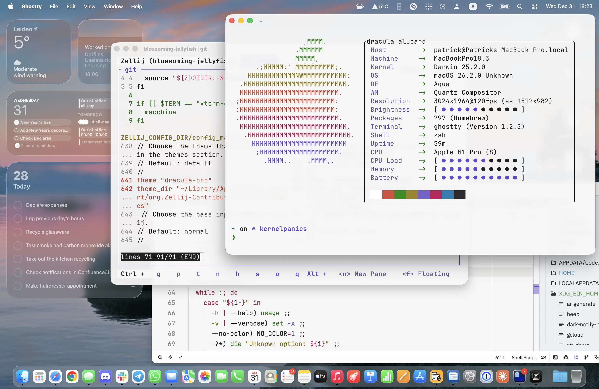
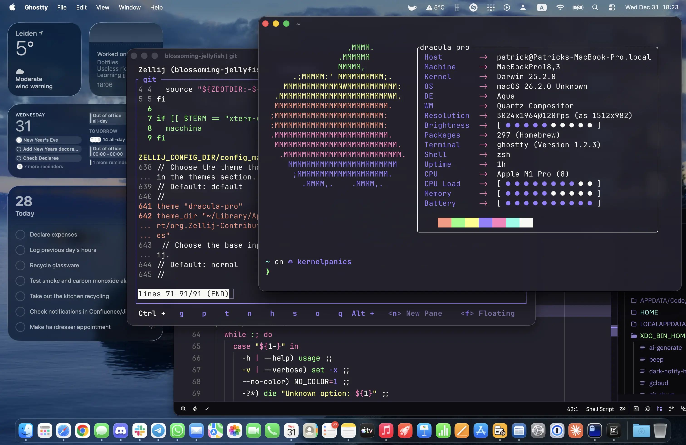

# @pgodschalk/dotfiles

[Report a Bug](https://github.com/pgodschalk/dotfiles/issues/new?assignees=&labels=bug&template=bug_report.md&title=bug%3A+)
·
[Request a Feature](https://github.com/pgodschalk/dotfiles/issues/new?assignees=&labels=enhancement&template=feature_request.md&title=feat%3A+)

My collection of dotfiles

[](LICENSE)

[](https://github.com/pgodschalk/dotfiles/issues?q=is%3Aissue+is%3Aopen+label%3A%22help+wanted%22)
[](https://github.com/pgodschalk)

- [About](#about)
  - [Built with](#built-with)
- [Getting started](#getting-started)
  - [Prerequisites](#prerequisites)
  - [Installation](#installation)
- [Usage](#usage)
- [Roadmap](#roadmap)
- [Support](#support)
- [Project assistance](#project-assistance)
- [Contributing](#contributing)
- [Authors & contributors](#authors--contributors)
- [Security](#security)
- [License](#license)
- [Acknowledgements](#acknowledgements)

## About

My collection of dotfiles. I mainly use this with [Ghostty](https://ghostty.org)
as a terminal emulator on macOS, and
[Windows Terminal](https://github.com/microsoft/terminal) on Windows.

[Zed](https://zed.dev) is my main editor, though I do keep
[Visual Studio Code](https://code.visualstudio.com) around mainly for Windows
support.

Other than that,

- [1Password](https://1password.com) is my secrets manager.
- [DevPod](https://devpod.io) is running development environments when I need
  more juice than my MacBook Pro can provide. Sometimes I run said environment
  on my Windows machine. Though I'll also use plain old Codespaces every now and
  then.
- [Monodraw](https://monodraw.helftone.com) is my diagramming tool.
- [OrbStack](https://orbstack.dev) runs my Docker containers, since Docker
  Desktop is just slow, and gets in my way a lot.
- [Passepartout](https://passepartoutvpn.app) is my VPN manager, other than
  Tailscale.
- [RapidAPI](https://rapidapi.com) is used for playing with API's, if
  [xh](https://github.com/ducaale/xh) isn't enough.
- [Secretive](https://github.com/maxgoedjen/secretive) is my SSH agent.
- [SnippetsLab](https://www.renfei.org/snippets-lab/) is where I keep my code
  snippets.
- [TablePlus](https://tableplus.com) is my database browser.
- [Tailscale](https://tailscale.com) is my personal VPN.
- [Ulysses](https://www.ulysses.app) is my long form Markdown editor.
- [UTM](https://mac.getutm.app) is my virtualization manager.
- [Xcode](https://developer.apple.com/xcode/) kinda just exists.

 

### Built with

- A whole bunch of stuff. :)

## Getting started

### Prerequisites

- A macOS or Linux environment to copy or symlink everything into.

### Installation

This is mostly just manual symlinks. Dotfile managers exist, but I don't like
them, since I'm pretty specific about where stuff gets stored. There is an
`install.sh`, but that's mainly intended for devcontainers.

## Usage

Symlink any dotfile you want to use.

```sh
rm ~/.something
ln -s ~/Developer/build/pgodschalk/dotfiles/.something ~/.something
```

## Roadmap

See the [open issues](https://github.com/pgodschalk/dotfiles/issues) for a list
of proposed features (and known issues).

- [Top Feature Requests](https://github.com/pgodschalk/dotfiles/issues?q=label%3Aenhancement+is%3Aopen+sort%3Areactions-%2B1-desc)
  (Add your votes using the 👍 reaction)
- [Top Bugs](https://github.com/pgodschalk/dotfiles/issues?q=is%3Aissue+is%3Aopen+label%3Abug+sort%3Areactions-%2B1-desc)
  (Add your votes using the 👍 reaction)
- [Newest Bugs](https://github.com/pgodschalk/dotfiles/issues?q=is%3Aopen+is%3Aissue+label%3Abug)

## Support

Reach out to the maintainer at one of the following places:

- [GitHub issues](https://github.com/pgodschalk/dotfiles/issues/new?assignees=&labels=question&template=04_SUPPORT_QUESTION.md&title=support%3A+)
- Contact options listed on [this GitHub profile](https://github.com/pgodschalk)

## Project assistance

If you want to say **thank you** or/and support active development of dotfiles:

- Add a [GitHub Star](https://github.com/pgodschalk/dotfiles) to the project.
- Write interesting articles about the project on [Dev.to](https://dev.to/),
  [Medium](https://medium.com/) or your personal blog.

Together, we can make dotfiles **better**!

## Contributing

First off, thanks for taking the time to contribute! Contributions are what make
the open-source community such an amazing place to learn, inspire, and create.
Any contributions you make will benefit everybody else and are **greatly
appreciated**.

Please read [our contribution guidelines](CONTRIBUTING.md), and thank you for
being involved!

## Authors & contributors

The original setup of this repository is by
[Patrick Godschalk](https://github.com/pgodschalk).

For a full list of all authors and contributors, see
[the contributors page](https://github.com/pgodschalk/dotfiles/contributors).

## Security

dotfiles follows good practices of security, but 100% security cannot be
assured. dotfiles is provided **"as is"** without any **warranty**. Use at your
own risk.

_For more information and to report security issues, please refer to our
[security documentation](SECURITY.md)._

## License

This project is licensed under the MIT license.

See [LICENSE](LICENSE.txt) for more information.

## Acknowledgements

- [$HOME/.hushlogin](https://github.com/mathiasbynens/dotfiles/blob/main/.hushlogin)
  from @mathiasbynens
- [$HOME/.ssh/config](https://infosec.mozilla.org/guidelines/openssh) from
  @mozilla
- [$XDG_BIN_HOME/beep](https://github.com/garybernhardt/dotfiles/blob/main/bin/beep)
  from @garybernhardt
- [$XDG_BIN_HOME/git-churn](https://github.com/garybernhardt/dotfiles/blob/main/bin/git-churn)
- [$XDG_BIN_HOME/git-divergence](https://github.com/garybernhardt/dotfiles/blob/main/bin/git-divergence)
- [$XDG_BIN_HOME/git-goodness](https://github.com/garybernhardt/dotfiles/blob/main/bin/git-goodness)
- [$XDG_BIN_HOME/git-what-the-hell-just-happened](https://github.com/garybernhardt/dotfiles/blob/main/bin/git-what-the-hell-just-happened)
- [$XDG_BIN_HOME/git-whodoneit](https://github.com/garybernhardt/dotfiles/blob/main/bin/git-whodoneit)
- [$XDG_BIN_HOME/githelpers](https://github.com/garybernhardt/dotfiles/blob/main/.githelpers)
  from @garybernhardt
- [$XDG_BIN_HOME/gn](https://github.com/garybernhardt/dotfiles/blob/main/bin/gn)
- [$XDG_BIN_HOME/gn.py](https://github.com/garybernhardt/dotfiles/blob/main/bin/gn.py)
- [$XDG_CONFIG_HOME/com.mitchellh.ghostty/config](https://github.com/mitchellh/nixos-config/blob/main/users/mitchellh/ghostty.linux)
  from @mitchellh
- [$XDG_CONFIG_HOME/git/attributes](https://github.com/gitattributes/gitattributes/tree/master/Global)
  from @gitattributes
- [$XDG_CONFIG_HOME/git/config](https://github.com/garybernhardt/dotfiles/blob/main/.gitconfig)
  from @garybernhardt
- [$XDG_CONFIG_HOME/git/config](https://blog.gitbutler.com/how-git-core-devs-configure-git)
  from @gitbutler
- [$XDG_CONFIG_HOME/git/config](https://www.git-tower.com/blog/make-git-rebase-safe-on-osx/)
  from @gittower
- [$XDG_CONFIG_HOME/git/config](https://jvns.ca/blog/2024/02/16/popular-git-config-options/)
  from @jvns
- [$XDG_CONFIG_HOME/git/config](https://github.com/mathiasbynens/dotfiles/blob/main/.gitconfig)
  from @mathiasbynens
- [$XDG_CONFIG_HOME/git/config](http://michael-kuehnel.de/git/2014/11/21/git-mac-osx-and-german-umlaute.html)
  from @mischah
- [$XDG_CONFIG_HOME/git/ignore](https://github.com/github/gitignore/tree/main/Global)
  from @github
- [$XDG_CONFIG_HOME/jj/config](https://github.com/mitchellh/nixos-config/blob/main/users/mitchellh/home-manager.nix)
  from @mitchellh
- [$XDG_CONFIG_HOME/nano/nanorc](https://bash-prompt.net/guides/nanorc-settings/)
  from Elliot Cooper
- [$XDG_CONFIG_HOME/python/pythonrc](https://github.com/b3nj5m1n/xdg-ninja/blob/main/programs/python.json#L4)
  from @b3nj5m1n
- [$XDG_CONFIG_HOME/readline/inputrc](https://github.com/mathiasbynens/dotfiles/blob/main/.inputrc)
  from @mathiasbynens
- [$XDG_CONFIG_HOME/starship/starship.toml](https://starship.rs/presets/nerd-font)
  from @starship
- [$XDG_CONFIG_HOME/vim/vimrc](https://github.com/mathiasbynens/dotfiles/blob/main/.vimrc)
  from @mathiasbynens
- [$XDG_CONFIG_HOME/.curlc](https://github.com/mathiasbynens/dotfiles/blob/main/.curlrc)
  from @mathiasbynens
- [$XDG_CONFIG_HOME/wgetrc](https://github.com/mathiasbynens/dotfiles/blob/main/.wgetrc)
  from @mathiasbynens
- [$XDG_DATA_HOME/gnupg/gpg.conf](https://github.com/drduh/config/blob/main/gpg.conf)
  from @drduh
- [$XDG_DATA_HOME/gnupg/gpg-agent.conf](https://github.com/drduh/config/blob/main/gpg-agent.conf)
  from @drduh
- [$ZDOTDIR/.aliases](https://github.com/mathiasbynens/dotfiles/blob/main/.aliases)
  from @mathiasbynens
- [$ZDOTDIR/.aliases](https://github.com/mitchellh/nixos-config/blob/main/users/mitchellh/home-manager.nix)
  from @mitchellh
- [$ZDOTDIR/.exports](https://github.com/mathiasbynens/dotfiles/blob/main/.exports)
  from @mathiasbynens
- [$ZDOTDIR/.functions](https://github.com/mathiasbynens/dotfiles/blob/main/.functions)
  from @mathiasbynens
- [$ZDOTDIR/.zprezto](https://github.com/sorin-ionescu/prezto) from
  @sorin-ionescu
