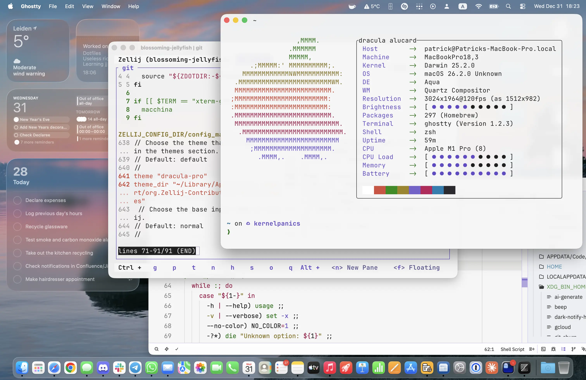
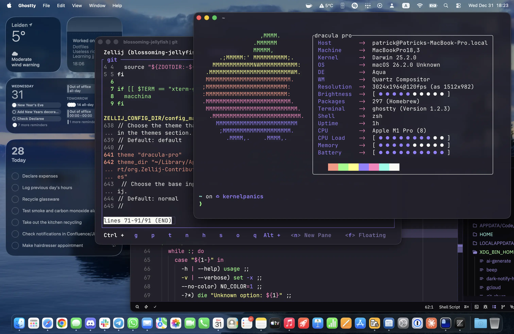

# @pgodschalk/dotfiles

[Report a Bug](https://github.com/pgodschalk/dotfiles/issues/new?assignees=&labels=bug&template=bug_report.md&title=bug%3A+)
·
[Request a Feature](https://github.com/pgodschalk/dotfiles/issues/new?assignees=&labels=enhancement&template=feature_request.md&title=feat%3A+)

My collection of dotfiles

[](LICENSE)

[](https://github.com/pgodschalk/dotfiles/issues?q=is%3Aissue+is%3Aopen+label%3A%22help+wanted%22)
[](https://github.com/pgodschalk)

- [About](#about)
  - [Built with](#built-with)
- [Getting started](#getting-started)
  - [Prerequisites](#prerequisites)
  - [Installation](#installation)
- [Usage](#usage)
- [Roadmap](#roadmap)
- [Support](#support)
- [Project assistance](#project-assistance)
- [Contributing](#contributing)
- [Authors & contributors](#authors--contributors)
- [Security](#security)
- [License](#license)
- [Acknowledgements](#acknowledgements)

## About

My collection of dotfiles. I mainly use this with [Ghostty](https://ghostty.org)
as a terminal emulator on macOS, and
[Windows Terminal](https://github.com/microsoft/terminal) on Windows.

[Zed](https://zed.dev) is my main editor, though I do keep
[Visual Studio Code](https://code.visualstudio.com) around mainly for Windows
support and Jupyter Notebooks (until that feature gets merged into mainline
Zed).

Other than that,

- [1Password](https://1password.com) is my secrets manager.
- [Lens](https://lenshq.io) is my Kubernetes IDE. I don't like TUI's but I also
  don't like typing `kubectl` (even with aliases) thousands of times per day.
- [Monodraw](https://monodraw.helftone.com) is my diagramming tool.
- [OrbStack](https://orbstack.dev) runs my Docker containers, since Docker
  Desktop is just slow, and gets in my way a lot.
- [Passepartout](https://passepartoutvpn.app) is my VPN manager, other than
  Tailscale.
- [RapidAPI](https://rapidapi.com) is used for playing with API's, if
  [xh](https://github.com/ducaale/xh) isn't enough.
- [Secretive](https://github.com/maxgoedjen/secretive) is my SSH agent.
- [SnippetsLab](https://www.renfei.org/snippets-lab/) is where I keep my code
  snippets.
- [TablePlus](https://tableplus.com) is my database browser.
- [Tailscale](https://tailscale.com) is my personal VPN.
- [Ulysses](https://www.ulysses.app) is my long form Markdown editor.
- [UTM](https://mac.getutm.app) is my virtualization manager.
- [Xcode](https://developer.apple.com/xcode/) kinda just exists.

 

### Built with

- [chezmoi](https://www.chezmoi.io)

## Getting started

### Prerequisites

- A macOS or Linux environment to copy or symlink everything into.

### Installation

These dotfiles are managed with [chezmoi](https://chezmoi.io). The chezmoi
source state lives in `home/` (see `.chezmoiroot`).

```sh
# Install chezmoi (macOS)
brew install chezmoi

# Initialise from this repo and apply
chezmoi init --apply pgodschalk/dotfiles
```

On a fresh machine, also remove any system-level `ZDOTDIR` override so the
chezmoi-managed `~/.zshenv` can bootstrap it:

```sh
sudo rm -f /etc/zshenv      # macOS
sudo rm -f /etc/zsh/zshenv  # Linux
```

## Usage

Edit the source and apply:

```sh
chezmoi edit ~/.config/git/config   # opens the source file
chezmoi apply                       # write changes to your home directory
chezmoi cd                          # drop into the source directory
```

The repo keeps the XDG convention, so `$XDG_CONFIG_HOME` resolves to
`~/Library/Application Support` on macOS but `~/.config` on Linux. Because
chezmoi derives each target path statically from its source path, shared files
are stored once as a canonical copy at their Linux target path
(`home/dot_config/…`, `home/dot_local/…`) and a small macOS stub under
`home/Library/…` pulls the canonical bytes in with chezmoi's `include` function.
`home/.chezmoiignore` selects the right subtree per OS.

### Dev containers

These dotfiles apply inside a dev container or
[GitHub Codespace](https://docs.github.com/en/codespaces/setting-your-user-account-preferences/personalizing-github-codespaces-for-your-account#dotfiles)
through the editor's personal dotfiles integration. Point your client at this
repo — in VS Code, set `dotfiles.repository` to `pgodschalk/dotfiles` — and it
clones the repo into the container and runs `install.sh`, which bootstraps
chezmoi from `home/`.

[Zed](https://zed.dev) uses its own native dev-container support — it does not
call the `devcontainer` CLI and has no dotfiles setting, so its "Reopen in Dev
Container" won't apply these on its own. Instead, bring the container up with
the `devcontainer` CLI first (installed via Homebrew — `brew "devcontainer"`),
then let Zed attach to it:

```sh
devcontainer up --workspace-folder . \
  --dotfiles-repository https://github.com/pgodschalk/dotfiles
```

The CLI clones this repo into the container and auto-runs `install.sh`, and tags
the container with labels derived from the workspace path. Zed reuses an
existing container matching those labels, so opening the same folder in Zed
attaches to the already-personalised container instead of building a fresh one.

`install.sh` bootstraps into `~/.local/bin` a curated set of general-purpose CLI
tools the shell integrates with:

- **chezmoi** (to apply the dotfiles), via
  [get.chezmoi.io](https://get.chezmoi.io).
- Via [mise](https://mise.jdx.dev) — into a dedicated `conf.d` drop-in:
  `starship`, `eza`, `bat`, `fd`, `fzf`, `ripgrep`, `zoxide`, `delta`,
  `difftastic`, `jaq`, `yq`, `xh`, `doggo`, `zellij`, `gh`, `glab`, `jj`,
  `helix`, `claude` (claude-code).
- Straight from their GitHub releases (not in mise's registry for every arch):
  `tldr`, `procs`, `tspin`, `macchina`, `miniserve`, plus `bat-extras`
  (`batgrep`, `batman`, …).

Language toolchains are deliberately left to the dev container definition.
`install.sh` exports `DOTFILES_DEVCONTAINER`, which makes the mise config skip
its language list (see `home/.chezmoitemplates/mise-config.tmpl`) — so the
`[tools]` block is empty in a container, while the CLI niceties above come from
the `conf.d` drop-in. Tools that _need_ a runtime — `gemini-cli`/`aicommit2`
(Node), `llm` (Python) — are left out for the same reason. Anything missing
degrades gracefully behind its `(( $+commands[…] ))` guard.

Secret-backed configs resolve each secret in order: a named **environment
variable** first, then **1Password** via `op`, then an empty fallback. So in a
container — where 1Password is usually unavailable — supply the secrets as env
vars through your platform's mechanism
([Codespaces secrets](https://docs.github.com/en/codespaces/managing-your-codespaces/managing-your-account-specific-secrets-for-github-codespaces),
or a local dev container's `remoteEnv`), and the apply picks them up. Anything
left unset degrades to empty instead of failing the apply. The variables are:

- `CONTEXT7_API_KEY` — Context7 MCP server (Zed, Gemini).
- `GITHUB_PERSONAL_ACCESS_TOKEN` — GitHub MCP server (Zed, Gemini); falls back
  to `GITHUB_TOKEN` when unset.
- `GHA_LANGUAGE_SERVER_TOKEN` — Zed gh-actions-language-server.
- `INTELEPHENSE_LICENCE_KEY` — intelephense license.

Codespaces injects a scoped `GITHUB_TOKEN`/`GH_TOKEN` automatically (and
pre-authenticates `gh`), so the GitHub MCP server picks it up via the fallback
above — subject to that token's scopes. The other variables are never set
automatically; add each one you want populated as a
[Codespaces secret](https://docs.github.com/en/codespaces/managing-your-codespaces/managing-your-account-specific-secrets-for-github-codespaces)
(or via a local dev container's `remoteEnv`).

#### Host integration

A few things lean on the macOS host.

**SSH & commit signing** use the Secretive (Secure Enclave) agent — forward the
host agent and both work, the key never leaving the Mac. Locally, add the
OrbStack agent socket at `up` time:

```sh
devcontainer up --workspace-folder . \
  --dotfiles-repository https://github.com/pgodschalk/dotfiles \
  --mount type=bind,source=/run/host-services/ssh-auth.sock,target=/ssh-agent \
  --remote-env SSH_AUTH_SOCK=/ssh-agent
```

In Codespaces the local agent isn't forwarded automatically. For **git**, enable
**GPG verification** (Settings → Codespaces) and GitHub signs commits with its
own key (Verified) via the system-level `gh-gpgsign`; the dotfiles detect
`$CODESPACES` and switch `gpg.format` back to `openpgp` (dropping the SSH
signing key) so they don't shadow it. For **jj**, or to sign with your own
enclave key, connect with `gh codespace ssh` (forwards the agent); the web
editor can't sign jj. Note signing stays forced, so without GPG verification
enabled (or a forwarded agent) commits fail rather than going unsigned.

- **1Password (`op`)** has no desktop-app socket in a container, so op-gated
  commands degrade (they run without their secrets).

- **Browser / ports.** Locally, Zed honors `appPort` and OrbStack routes
  `<name>.orb.local`; Codespaces forwards ports automatically to
  `https://<codespace>-<port>.app.github.dev`.

- **Theme.** The shell follows macOS light/dark by querying the terminal (OSC
  11), and themes from your Dracula Pro repos when they can be cloned
  (`pgodschalk/dracula-pro-extras`, `dracula-pro/dracula-pro`) — via the
  forwarded agent / `gh` locally, or a `DOTFILES_THEME_PAT` Codespaces secret
  (classic PAT, `repo` scope). It falls back to built-in themes otherwise.

## Roadmap

See the [open issues](https://github.com/pgodschalk/dotfiles/issues) for a list
of proposed features (and known issues).

- [Top Feature Requests](https://github.com/pgodschalk/dotfiles/issues?q=label%3Aenhancement+is%3Aopen+sort%3Areactions-%2B1-desc)
  (Add your votes using the 👍 reaction)
- [Top Bugs](https://github.com/pgodschalk/dotfiles/issues?q=is%3Aissue+is%3Aopen+label%3Abug+sort%3Areactions-%2B1-desc)
  (Add your votes using the 👍 reaction)
- [Newest Bugs](https://github.com/pgodschalk/dotfiles/issues?q=is%3Aopen+is%3Aissue+label%3Abug)

## Support

Reach out to the maintainer at one of the following places:

- [GitHub issues](https://github.com/pgodschalk/dotfiles/issues/new?assignees=&labels=question&template=04_SUPPORT_QUESTION.md&title=support%3A+)
- Contact options listed on [this GitHub profile](https://github.com/pgodschalk)

## Project assistance

If you want to say **thank you** or/and support active development of dotfiles:

- Add a [GitHub Star](https://github.com/pgodschalk/dotfiles) to the project.
- Write interesting articles about the project on [Dev.to](https://dev.to/),
  [Medium](https://medium.com/) or your personal blog.

Together, we can make dotfiles **better**!

## Contributing

First off, thanks for taking the time to contribute! Contributions are what make
the open-source community such an amazing place to learn, inspire, and create.
Any contributions you make will benefit everybody else and are **greatly
appreciated**.

Please read [our contribution guidelines](CONTRIBUTING.md), and thank you for
being involved!

## Authors & contributors

The original setup of this repository is by
[Patrick Godschalk](https://github.com/pgodschalk).

For a full list of all authors and contributors, see
[the contributors page](https://github.com/pgodschalk/dotfiles/contributors).

## Security

dotfiles follows good practices of security, but 100% security cannot be
assured. dotfiles is provided **"as is"** without any **warranty**. Use at your
own risk.

_For more information and to report security issues, please refer to our
[security documentation](SECURITY.md)._

## License

This project is licensed under the EUPL-1.2 license.

See [LICENSE](LICENSE.txt) for more information.

## Acknowledgements

- [$HOME/.hushlogin](https://github.com/mathiasbynens/dotfiles/blob/main/.hushlogin)
  from [@mathiasbynens](https://github.com/mathiasbynens)
- [$HOME/.ssh/config](https://infosec.mozilla.org/guidelines/openssh) from
  [@mozilla](https://github.com/mozilla)
- [$XDG_BIN_HOME/beep](https://github.com/garybernhardt/dotfiles/blob/main/bin/beep)
  from [@garybernhardt](https://github.com/garybernhardt)
- [$XDG_BIN_HOME/git-churn](https://github.com/garybernhardt/dotfiles/blob/main/bin/git-churn)
- [$XDG_BIN_HOME/git-divergence](https://github.com/garybernhardt/dotfiles/blob/main/bin/git-divergence)
- [$XDG_BIN_HOME/git-goodness](https://github.com/garybernhardt/dotfiles/blob/main/bin/git-goodness)
- [$XDG_BIN_HOME/git-what-the-hell-just-happened](https://github.com/garybernhardt/dotfiles/blob/main/bin/git-what-the-hell-just-happened)
- [$XDG_BIN_HOME/git-whodoneit](https://github.com/garybernhardt/dotfiles/blob/main/bin/git-whodoneit)
- [$XDG_BIN_HOME/githelpers](https://github.com/garybernhardt/dotfiles/blob/main/.githelpers)
  from [@garybernhardt](https://github.com/garybernhardt)
- [$XDG_BIN_HOME/gn](https://github.com/garybernhardt/dotfiles/blob/main/bin/gn)
- [$XDG_BIN_HOME/gn.py](https://github.com/garybernhardt/dotfiles/blob/main/bin/gn.py)
- [$XDG_CONFIG_HOME/com.mitchellh.ghostty/config](https://github.com/mitchellh/nixos-config/blob/main/users/mitchellh/ghostty.linux)
  from [@mitchellh](https://github.com/mitchellh)
- [$XDG_CONFIG_HOME/git/attributes](https://github.com/gitattributes/gitattributes/tree/master/Global)
  from [@gitattributes](https://github.com/gitattributes)
- [$XDG_CONFIG_HOME/git/config](https://github.com/garybernhardt/dotfiles/blob/main/.gitconfig)
  from [@garybernhardt](https://github.com/garybernhardt)
- [$XDG_CONFIG_HOME/git/config](https://blog.gitbutler.com/how-git-core-devs-configure-git)
  from [@gitbutler](https://github.com/gitbutler)
- [$XDG_CONFIG_HOME/git/config](https://www.git-tower.com/blog/make-git-rebase-safe-on-osx/)
  from [@gittower](https://github.com/gittower)
- [$XDG_CONFIG_HOME/git/config](https://jvns.ca/blog/2024/02/16/popular-git-config-options/)
  from [@jvns](https://github.com/jvns)
- [$XDG_CONFIG_HOME/git/config](https://github.com/mathiasbynens/dotfiles/blob/main/.gitconfig)
  from [@mathiasbynens](https://github.com/mathiasbynens)
- [$XDG_CONFIG_HOME/git/config](http://michael-kuehnel.de/git/2014/11/21/git-mac-osx-and-german-umlaute.html)
  from [@mischah](https://github.com/mischah)
- [$XDG_CONFIG_HOME/git/ignore](https://github.com/github/gitignore/tree/main/Global)
  from [@github](https://github.com/github)
- [$XDG_CONFIG_HOME/jj/config](https://github.com/mitchellh/nixos-config/blob/main/users/mitchellh/home-manager.nix)
  from [@mitchellh](https://github.com/mitchellh)
- [$XDG_CONFIG_HOME/nano/nanorc](https://bash-prompt.net/guides/nanorc-settings/)
  from Elliot Cooper
- [$XDG_CONFIG_HOME/python/pythonrc](https://github.com/b3nj5m1n/xdg-ninja/blob/main/programs/python.json#L4)
  from [@b3nj5m1n](https://github.com/b3nj5m1n)
- [$XDG_CONFIG_HOME/readline/inputrc](https://github.com/mathiasbynens/dotfiles/blob/main/.inputrc)
  from [@mathiasbynens](https://github.com/mathiasbynens)
- [$XDG_CONFIG_HOME/starship/starship.toml](https://starship.rs/presets/nerd-font)
  from [@starship](https://github.com/starship)
- [$XDG_CONFIG_HOME/vim/vimrc](https://github.com/mathiasbynens/dotfiles/blob/main/.vimrc)
  from [@mathiasbynens](https://github.com/mathiasbynens)
- [$XDG_CONFIG_HOME/.curlc](https://github.com/mathiasbynens/dotfiles/blob/main/.curlrc)
  from [@mathiasbynens](https://github.com/mathiasbynens)
- [$XDG_CONFIG_HOME/wgetrc](https://github.com/mathiasbynens/dotfiles/blob/main/.wgetrc)
  from [@mathiasbynens](https://github.com/mathiasbynens)
- [$XDG_DATA_HOME/gnupg/gpg.conf](https://github.com/drduh/config/blob/main/gpg.conf)
  from [@drduh](https://github.com/drduh)
- [$XDG_DATA_HOME/gnupg/gpg-agent.conf](https://github.com/drduh/config/blob/main/gpg-agent.conf)
  from [@drduh](https://github.com/drduh)
- [$ZDOTDIR/.aliases](https://github.com/mathiasbynens/dotfiles/blob/main/.aliases)
  from [@mathiasbynens](https://github.com/mathiasbynens)
- [$ZDOTDIR/.aliases](https://github.com/mitchellh/nixos-config/blob/main/users/mitchellh/home-manager.nix)
  from [@mitchellh](https://github.com/mitchellh)
- [$ZDOTDIR/.exports](https://github.com/mathiasbynens/dotfiles/blob/main/.exports)
  from [@mathiasbynens](https://github.com/mathiasbynens)
- [$ZDOTDIR/.functions](https://github.com/mathiasbynens/dotfiles/blob/main/.functions)
  from [@mathiasbynens](https://github.com/mathiasbynens)
- [$ZDOTDIR/.zprezto](https://github.com/sorin-ionescu/prezto) from
  [@sorin-ionescu](https://github.com/sorin-ionescu)
